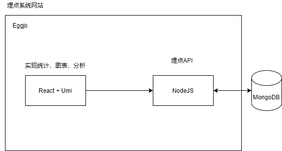

# 埋点系统

埋点是数据领域的专业术语，也是互联网应用里的一个俗称。它的学名应该叫做事件追踪，对应的英文是Event Tracking。
埋点主要为了方便的进行数据采集，分析，进而对网站/APP进行优化。
目前主流采用三种方案

- 代码埋点：在需要上传数据的地方主动调用API进行上传
- 可视化埋点：通过可视化工具配置采集节点，采用XPATH或者JS path方式获取节点
- 无埋点：它并不是真正的不需要埋点，而是前端自动采集全部事件并上报埋点数据，然后后端进行过滤分析处理需要的数据并进行展示。

前期先采用代码埋点，后期可考虑转成可视化埋点和无埋点方案。
参考[美团点评前端无痕埋点实践](https://tech.meituan.com/2017/03/02/mt-mobile-analytics-practice.html):

>“就目前实践阶段的数据来看，业务中大约70%左右的埋点需求可以通过无痕埋点解决，而对于另外30%的埋点需求，仍然需要使用声明式埋点和代码埋点。”

## 代码埋点

优点：使用灵活，容易理解，
缺点：对代码有一定侵入性，开发量大，破坏具体业务逻辑，一但上线后出现埋点异常，只能通过发布热修复才能修复

因此采用前人已经验证使用的声明式埋点方式。
>
声明式埋点的思路是将埋点代码和具体的交互和业务逻辑解耦，开发者只用关心需要埋点的控件，并且为这些控件声明需要的埋点数据即可，从而降低埋点的成本。

接口定义：/sendEventData
请求方式：POST
请求Body：JSON

参数 | 必填/选填| 类型  | 说明
---- | --- | --- | --- | ---
event | 必填 | string | 记录事件的类型，如“点击”，“收藏”，“下单” |
timestamp | 必填 | number | 记录时间发生的时间的时间戳 |
properties | 必填 | object | 记录时间相关的值，具体查看实例

例：

```json
{ 
  event:"click",
  timestamp:"1630650672",
  properties:{
    uuid:"uuid",
    category:"注册",
    value:'',
  }
}
```


